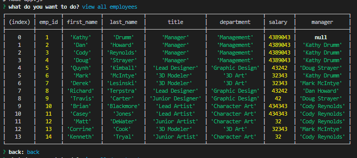
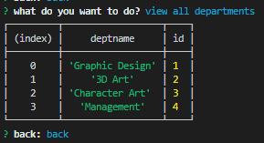
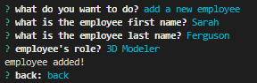
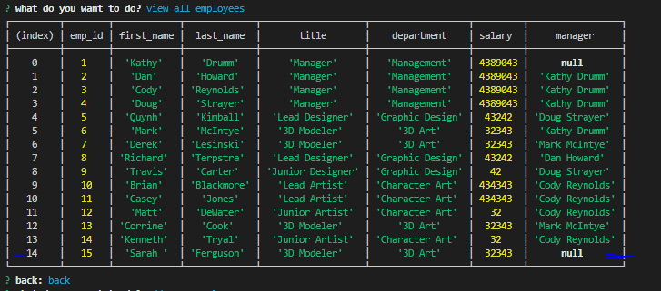
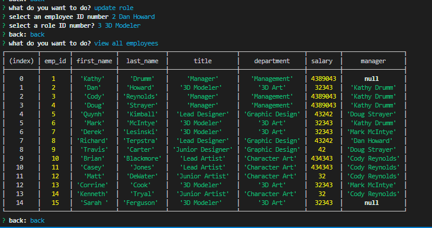

# EmployeeTracker

https://www.youtube.com/watch?v=yj5e8Kf_T8I&feature=youtu.be

## Description

Developers are often tasked with creating interfaces that make it easy for non-developers to view and interact with information stored in databases. Often these interfaces are known as **C**ontent **M**anagement **S**ystems. In this homework assignment, my challenge was to architect and build a solution for managing a company's employees using node, inquirer, and MySQL.

  ## Table of Contents 
  
  * [Installation](#installation) 
  * [Business Context](#businesscontext)
  * [License](#license)
  * [Contribution](#contributions)
  * [Screenshots](#tests)
  * [Questions](#questions)

## Installation
  
In order to install the app on your own machine to run as local host you must npm i all dependancies, as well as input the schema in DBeaver. 

## Business Context

For business owners who want to be able to view and manage the departments, roles, and employees in companies for organization and planning

 ## License
  
This project is licensed under none.

## Contributions
  
No contributors. 

## Screenshots

 

 

 

 

 

 

 

 

 

 

 

 ## Questions

 If you have any questions email me at sarahlferguson07@gmail.com
  
 My Github account is https://github.com/saarahah
  
  
  ---
  © 2020